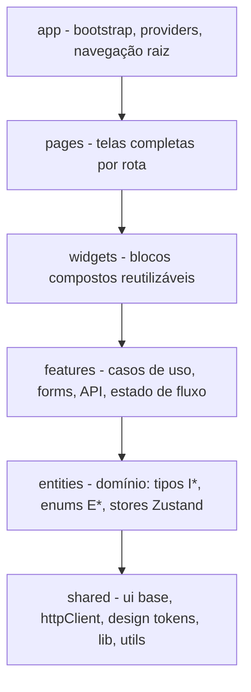

# Arquitetura de camadas — Feature-Sliced Design (st-app-rn)

> Documento canônico da arquitetura FSD deste repositório. Agents, skills e rules do `.cursor/` citam as seções deste documento pela numeração (§1–§14). **Não renumerar seções sem atualizar todas as referências.**

Fontes complementares: `AGENTS.md` (visão geral e checklist de contribuição), `eslint.config.mjs` (validação automática), rules em `.cursor/rules/fsd-*.mdc`.

---

## 1. Visão geral

O projeto segue **Feature-Sliced Design (FSD)** com seis camadas. Uma camada só pode importar camadas **abaixo** dela.

### 1.1 Diagrama de camadas



### 1.2 Caminhos reais

| Camada | Pasta |
|---|---|
| App | `src/app` |
| Pages | `src/pages` |
| Widgets | `src/widgets` |
| Features | `src/features` |
| Entities | `src/entities` |
| Shared | `src/shared` |

Não usar pastas numeradas (`01-app`, `06-shared`). Imports externos a um slice usam alias absoluto `@/` + barrel (`@/features/auth`).

### 1.3 Estrutura interna de um slice

```text
src/features/<slice>/
├── index.ts        ← public API (barrel): só o que outras camadas podem usar
├── api/            ← chamadas REST (httpClient), Amplify, integrações
├── model/          ← stores Zustand, validação, funções puras do fluxo
├── ui/             ← componentes React do caso de uso
└── __tests__/      ← testes de integração do slice (*.spec.tsx)
```

---

## 2. Hierarquia de dependências e simetria com o back-end

Só se importa **para baixo**:

```text
app → pages → widgets → features → entities → shared
```

- `shared` **não** importa `entities`, `features`, `widgets`, `pages`, `app`.
- `entities` **não** importa `features`, `widgets`, `pages`, `app`.
- `features` **não** importa `widgets`, `pages`, `app`, nem **outro slice** de `src/features/`.
- `widgets` **não** importa `pages` nem `app`.

### Simetria com o back-end

| Back-end | Front-end | Responsabilidade no front |
|---|---|---|
| Domain | `entities` | Tipos `I*` espelhados da API, stores de domínio |
| Service | `features` | Casos de uso, validação, chamadas de API |
| Controllers HTTP | `pages` + `widgets` | Orquestração de UI, sem regra de negócio |
| Infraestrutura | `shared` | `httpClient`, adapters, tokens |
| Bootstrap / wiring | `app` | Providers, navegação raiz, SDKs |

---

## 3. Camada `app`

**DEVE:**

- `AppNavigator`, providers globais, inicialização de SDKs (EAS Update, Sentry, i18n).
- Definir `initialRouteName` com base em estado já exposto por stores (ex.: `useUserStore`), sem duplicar a decisão de fluxo.
- Registrar `Stack.Screen` apontando para componentes de `pages`.

**NÃO DEVE:**

- Conter regra de negócio ou chamadas de API de produto.
- Importar arquivos internos de slices (usar barrels).

---

## 4. Camada `pages`

**DEVE:**

- Um componente de tela por rota; layout, scroll, teclado (`KeyboardAvoidingView`), safe area, animações de tela.
- Importar features via **barrel** (`@/features/auth`), widgets, shared UI e assets.
- Reagir aos estados expostos pelas features (loading, erro, vazio, sucesso).

**NÃO DEVE:**

- Chamar `axios`, `httpClient` ou Amplify diretamente.
- Validar regra de negócio (ex.: "email já existe").
- Duplicar validação que pertence à feature.

```tsx
// ✅ Composição mínima + UI shared + feature pública
import { LoginForm } from '@/features/auth';
import { Logo } from '@/shared/ui/logo';

export const LoginScreen = () => (
  <View>
    <Logo />
    <LoginForm />
  </View>
);
```

---

## 5. Camada `widgets`

**DEVE:**

- Blocos compostos reutilizáveis (header, carrossel, bottom nav) que combinam features, entities e shared.
- Receber composição via children/callbacks injetados quando precisa coordenar mais de um fluxo.

**NÃO DEVE:**

- Importar `pages` ou `app`.
- Duplicar um caso de uso inteiro (isso é `features`).
- Chamar rede diretamente.

---

## 6. Camada `features`

Cada slice é **um caso de uso** com segmentos `api/`, `model/`, `ui/` e barrel `index.ts`.

**DEVE concentrar:**

- Chamadas REST via `httpClient` e integrações (Amplify etc.) em `api/`.
- Formulários com **React Hook Form** e validação em `model/`/`ui/`.
- Estado do fluxo em **Zustand** dentro de `model/` (não `useState`/`useReducer`).
- Estados de interação: loading, erro, retry, sucesso, vazio.
- Atualizar store de `entities` após sucesso, quando o estado é global.

**NÃO DEVE:**

- Importar outro slice de `features` (nem pelo barrel) — ver §12.
- Importar `widgets`, `pages` ou `app`.

```ts
// ✅ features/orders/api/fetch-orders.ts
import { httpClient } from '@/shared/lib/http';

export async function fetchOrders(): Promise<IOrder[]> {
  const { data } = await httpClient.get<IOrder[]>('/orders');
  return data;
}
```

### Estado — Zustand obrigatório

- Estado de domínio, fluxo de tela, dados carregados, flags de UI comportamentais, wizards e caches vivem em **Zustand** (`create` + actions/selectors), em `entities/<slice>/model/*-store.ts` (domínio reutilizável) ou `features/<slice>/model/*-store.ts` (estado do caso de uso).
- Consumir nos componentes pelos hooks do store (ex.: `useUserStore`), não com estado local.
- **Única exceção:** bibliotecas cujo contrato depende de hooks próprios (ex.: React Hook Form / `useForm`). Não duplicar o mesmo dado em `useState` paralelo.

---

## 7. Camada `entities`

**DEVE:**

- Interfaces de domínio `I*` e enums `E*` espelhando o back-end.
- Stores Zustand de domínio **sem I/O de rede** (`set`, `logout`, seletores).
- Componentes de apresentação simples da entidade (ex.: avatar do usuário).

**NÃO DEVE:**

- Importar `@aws-amplify/auth`, `axios` ou `httpClient` para efeitos de produto — quem chama rede é `features`.
- Importar `features`, `widgets`, `pages` ou `app`.

```ts
// ❌ entities/user/model/user-store.ts
fetchUser: async () => { await httpClient.get('/me'); } // I/O na entity — proibido
```

---

## 8. Camada `shared`

Agnóstica ao negócio. Segmentos:

| Segmento | Propósito |
|---|---|
| `shared/ui` | Componentes de apresentação sem domínio (Button, Input) |
| `shared/api` | Configuração do cliente HTTP |
| `shared/design` | Tokens, tipografia, tema Tailwind |
| `shared/lib` | Adapters de terceiros (i18n, http, observability, auth) |
| `shared/utils` | Helpers puros e genéricos (máscara de telefone, E.164) |

**NÃO DEVE:**

- Conter vocabulário de negócio ("Patient", "Hospital", fluxo clínico), rotas de domínio (`/patients`) ou mensagens de erro de produto.
- `axios.create` e interceptors vivem **apenas** em `shared/lib/http` (ou módulo shared acordado).

---

## 9. Contratos API / TypeScript

- Respostas e DTOs alinhados ao back-end: interfaces **`I*`** em **`entities`** quando reutilizáveis entre slices; tipos exclusivos do fluxo podem viver na própria feature.
- Enums **`E*`** com membros `UPPER_SNAKE_CASE` espelhando códigos do back-end (ex.: códigos de erro de domínio como `USER_NOT_CONFIRMED`).
- `httpClient` é configurado só em `shared`; **chamadas** REST de produto ficam em `features/<slice>/api`.
- Erros de negócio da API devem ser mapeados para feedback acionável na UI (nunca exibir erro cru do servidor).
- Nullability e campos opcionais do contrato devem estar refletidos nos tipos (`string | null`, `?`), sem `any`.

---

## 10. Validação automática (ESLint)

`eslint.config.mjs` aplica as regras do plugin `@conarti/feature-sliced`:

| Regra | O que valida |
|---|---|
| `layers-slices` | Hierarquia de camadas e isolamento entre slices (com `allowTypeImports: true` para imports só de tipo) |
| `public-api` | Consumo externo passa pelo barrel `index.ts` do slice |
| `absolute-relative` | Alias absoluto `@/` entre slices; relativo dentro do slice |

- Código que viole essas regras **não deve ser merged** sem correção.
- `allowTypeImports` permite importar **apenas tipos** de camada superior para assinaturas; não autoriza importar valores/runtime.
- Rodar `yarn lint` após qualquer alteração em `src/**`.

---

## 11. Testes

| Tipo | Extensão | Localização |
|---|---|---|
| Unitário | `*.test.ts(x)` | Co-localizado, mesmo diretório do arquivo testado |
| Integração do slice | `*.spec.ts(x)` | `__tests__/` na raiz do slice |
| E2E | conforme ferramenta | `e2e/` na raiz do projeto (fora de `src/`) |

Convenções obrigatórias:

- Cada `describe` contém **exatamente um** `it`.
- Descrições em inglês: `describe('When ...')` e `it('should ...')`.
- Unitários de `model/`: mocks de `api`, funções puras, stores com `act`.
- Integração `*.spec`: renderizar a UI do slice com providers, mockar rede/Amplify no limite do `api/`, validar fluxo feliz e de erro.
- Testes também respeitam FSD e public API ao importar código de produção.

Comandos:

```bash
yarn test:unit        # só *.test.*
yarn test:integration # só *.spec.*
yarn test             # suíte completa
yarn test:coverage    # meta ≥ 80%
yarn lint             # inclui validação FSD
```

---

## 12. Partilha entre duas `features`

Um slice de `features` **nunca** importa outro. Árvore de decisão, em ordem:

1. **Dados/tipo global** usados por ambos → mover para **`entities`**.
2. **Helper 100% genérico** (sem regra de produto) → mover para **`shared`** (`utils` ou `lib`).
3. **Composição:** a **`page`** (ou `widget` com children/callbacks injetados) monta os dois fluxos, sem um feature importar o outro.
4. Se o acoplamento persistir → **redesenhar** o caso de uso: unificar num único slice ou extrair um port tipado em `entities`.

```ts
// ❌ src/features/checkout/ui/payment-form.tsx
import { loginRequest } from '@/features/auth'; // outro slice, mesmo pelo barrel
```

---

## 13. Checklist de conformidade

Antes de abrir PR com mudanças em `src/**`:

- [ ] Imports respeitam a hierarquia (só para baixo) e não cruzam slices de `features`.
- [ ] Consumo externo a slices passa pelo barrel `index.ts` (sem deep imports).
- [ ] Rede/SDK de produto só em `features/<slice>/api`; `httpClient` configurado só em `shared`.
- [ ] Stores de `entities` sem I/O de rede.
- [ ] Estado gerido por Zustand (exceção: hooks obrigatórios de biblioteca, ex. React Hook Form).
- [ ] `shared` sem vocabulário de negócio.
- [ ] Strings de UI via i18n (`t('domain.key')`), sem hardcode.
- [ ] Estilos via tema Tailwind (tokens), sem valores arbitrários ou hex inline.
- [ ] Tipos `I*`/enums `E*` alinhados ao contrato do back-end.
- [ ] Testes criados/atualizados conforme §11; `describe('When...')` / `it('should...')`.
- [ ] `yarn lint` e `yarn test` passam; cobertura ≥ 80% (`yarn test:coverage`).

---

## 14. Resumo — regras de ouro

1. Importar só **para baixo**: `app → pages → widgets → features → entities → shared`.
2. **Nenhum** import entre slices de `features` — resolver via §12.
3. Consumo externo a um slice **sempre** pelo barrel `index.ts`.
4. Rede e SDKs de produto vivem em `features/<slice>/api`; configuração de cliente em `shared`.
5. `pages`/`widgets` orquestram UI; regra de negócio é da `features`.
6. `entities` guarda domínio (tipos, enums, stores) **sem** I/O.
7. `shared` é 100% agnóstica ao negócio.
8. Estado em **Zustand**; `useState`/`useReducer` só quando uma biblioteca exige.
9. i18n e Design System (tokens Tailwind) obrigatórios em toda UI.
10. `yarn lint` + `yarn test` após editar; cobertura ≥ 80%.
