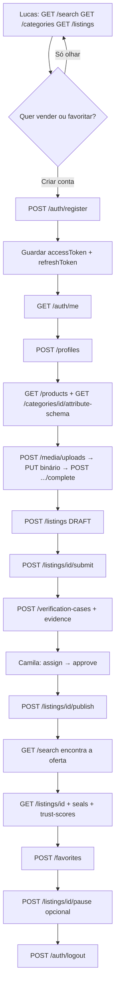

# Fluxo completo: da conta ao anúncio publicado (e o fim da jornada)

Este guia descreve **o caminho HTTP real** do GamerTrust, da criação de conta até a oferta aparecer na busca — e o que acontece depois (favoritar, pausar, sair). Cada passo aponta para o contrato gerado (curl, req, res, erros).

| | |
|--|--|
| **Persona primária (vender)** | Carlos — vendedor que quer listar um item usado com evidência, sem fingir selo |
| **Contraste (comprar)** | Lucas — busca na home sem conta; só autentica para favoritar |
| **Anti-persona** | Quem tenta spoofar `x-user-id`, enumerar e-mail no cadastro, ou mostrar selo sem `GRANTED` |
| **Base URL** | `http://localhost:3000` |
| **Contrato canônico** | [`gt-backend/src/contracts/service.yaml`](../../../gt-backend/src/contracts/service.yaml) |

**Não negociável na UI:** confiança > volume; produto ≠ oferta; IA não inventa atributos/estado/selo; TrustScore vem com motivos da API.

---

## Mapa da jornada



Há **dois atores HTTP** no trecho operacional:

| Quem | Group no JWT | O que faz |
|------|----------------|-----------|
| Carlos (`app-user`) | `app-user` | register, perfil, mídia, draft, submit, evidência, pausar, favoritar |
| Camila (`backoffice` ou `admin`) | `backoffice` / `admin` | assign, approve/reject, **publish**, revoke seal, taxonomia, `POST /users` |

O comprador Lucas usa só GETs públicos até favoritar (aí precisa de Bearer).

Índice de todos os 66 endpoints: [README.md](./README.md).

---

## 0. Constantes de sessão (todo o fluxo autenticado)

Depois de register/login, **todo** request protegido leva:

```http
Authorization: Bearer <accessToken>
Accept: application/json
```

- Access JWT: curto. Em 401 `AUTH_UNAUTHORIZED`, chamar [`POST /auth/refresh`](./auth/auth/post-auth-refresh/) com o refresh opaco. Se o refresh falhar (401), ir para login.
- Logout **invalida na hora** o access **desta** sessão (outras sessões do mesmo user continuam).
- **Não enviar** `x-user-id` / `x-user-groups` como identidade. O backend só confia no JWT. (Alguns paths ainda listam esses headers no OpenAPI por legado; o front não deve usá-los.)
- Throttle de auth: **20 tentativas / 15 min / IP** em register, login e refresh → **429**. Copy genérica; não enumerar e-mail/CPF.

Detalhe: [02-sessao-e-tokens.md](./02-sessao-e-tokens.md).

---

## 1. Discovery sem conta (Lucas)

Persona: Lucas na home. Busca dominante, sem login.

### 1.1 Categorias e produtos (catálogo = modelo)

| Passo | Endpoint | Contrato |
|-------|----------|----------|
| Listar categorias | `GET /categories` | [abrir](./catalog/categories/get-categories/) |
| Detalhe da categoria | `GET /categories/{id}` | [abrir](./catalog/categories/get-categories-by-id/) |
| Schema de atributos (formulário futuro) | `GET /categories/{categoryId}/attribute-schema` | [abrir](./catalog/categories/get-categories-by-categoryId-attribute-schema/) |
| Listar produtos (modelo) | `GET /products` | [abrir](./catalog/products/get-products/) |
| Ficha do modelo | `GET /products/{id}` | [abrir](./catalog/products/get-products-by-id/) |
| Histórico de preço do **modelo** | `GET /products/{productId}/price-history` | [abrir](./catalog/products/get-products-by-productId-price-history/) |
| Serviços | `GET /services` | [abrir](./catalog/services/get-services/) |

```bash
curl -X GET 'http://localhost:3000/categories' \
  -H 'Accept: application/json'
```

**Sucesso 200:** array de `Category`. **Erro 500:** falha de infra — empty-state, sem inventar categorias.

Produto ≠ oferta: `Product` é o modelo (ex.: “PS5 Digital 1TB”). A unidade à venda é `Listing`.

### 1.2 Ofertas e busca

| Passo | Endpoint | Contrato |
|-------|----------|----------|
| Feed de listings | `GET /listings` | [abrir](./listings/listings/get-listings/) |
| PDP da oferta | `GET /listings/{id}` | [abrir](./listings/listings/get-listings-by-id/) |
| Busca lexical | `GET /search?q=` | [abrir](./search/search/get-search/) |
| Sinônimos (expansão) | `GET /synonyms` | [abrir](./search/synonyms/get-synonyms/) |

```bash
curl -X GET 'http://localhost:3000/search?q=ps5' \
  -H 'Accept: application/json'
```

**Sucesso 200:** documentos de busca. Só listings **`PUBLISHED`** entram no índice. Draft/submitted **não** aparecem para Lucas.

### 1.3 Confiança na PDP (sem fingir selo)

Na página do anúncio, **nessa ordem de dados**:

1. `GET /listings/{id}` — preço, condição, `status`
2. `GET /seals?listingId=` — **só renderizar selo se `status === "GRANTED"`**
3. `GET /trust-scores/{sellerId}` — número + `components`
4. `GET /trust-events?sellerId=` — motivos em texto
5. `GET /seller-levels/{sellerId}` — `NEW` | `EVOLVING` | `TRUSTED` | `EXCELLENT`
6. `GET /profiles/by-user/{sellerId}` — nome de vitrine

Contratos: [seals](./verification/seals/get-seals/), [trust-scores](./trust/trust-scores/get-trust-scores-by-sellerId/), [trust-events](./trust/trust-events/get-trust-events/), [seller-levels](./trust/seller-levels/get-seller-levels-by-sellerId/), [perfil](./identity/profiles/get-profiles-by-user-by-userId/).

Se `seals` vier vazio ou `REVOKED`: **não** pintar ícone de verificado.

---

## 2. Criar conta (Carlos ou Lucas)

Cadastro **público**. Não usar `POST /users` (isso é ADMIN, sem senha).

Contrato: [POST /auth/register](./auth/auth/post-auth-register/).

### Request

Schema [`NewAuthRegistration`](./_schemas/NewAuthRegistration.md): `id`, `fullName`, `email`, `phone`, `cpf`, `birthDate` (YYYY-MM-DD), `password`.

```bash
curl -X POST 'http://localhost:3000/auth/register' \
  -H 'Accept: application/json' \
  -H 'Content-Type: application/json' \
  -d '{
    "id": "user-carlos-1",
    "fullName": "Carlos Silva",
    "email": "carlos@example.com",
    "phone": "11999999999",
    "cpf": "12345678901",
    "birthDate": "1990-05-12",
    "password": "uma-senha-forte"
  }'
```

### Sucesso — 201

Body [`AuthSession`](./_schemas/AuthSession.md):

```json
{
  "user": {
    "id": "user-carlos-1",
    "fullName": "Carlos Silva",
    "email": "carlos@example.com",
    "phone": "11999999999",
    "cpf": "12345678901",
    "birthDate": "1990-05-12",
    "verified": false,
    "phoneVerified": false,
    "status": "ACTIVE",
    "groups": ["app-user"],
    "createdAt": "2026-08-13T12:00:00.000Z"
  },
  "accessToken": "<jwt>",
  "refreshToken": "<opaco>"
}
```

**O que o front faz:** persistir `accessToken` + `refreshToken` (memória + storage seguro o bastante para o canal web; nunca no log). `User` **não** contém senha. Group padrão `app-user`. `verified: false` **não** autoriza selo de identidade na UI.

### Erros

| HTTP | Código típico | Quando | UI |
|------|----------------|--------|----|
| 400 | `FIELD_INVALID` | validação **ou** e-mail/CPF já existente | Destacar campos. **Não** dizer “este e-mail já existe” — duplicata é 400 uniforme de propósito (anti-enumeração). |
| 400 | `USER_UNDERAGE` | menor de idade | Bloquear cadastro com copy de idade mínima. |
| 429 | (body `{ message }`) | throttle IP | Backoff; copy genérica. |
| 500 | catálogo | infra | Erro genérico. |

`POST /users` (ADMIN) em e-mail duplicado continua **409**. São fluxos diferentes.

---

## 3. Login, hidratar sessão, refresh, logout

### 3.1 Login — [POST /auth/login](./auth/auth/post-auth-login/)

```bash
curl -X POST 'http://localhost:3000/auth/login' \
  -H 'Accept: application/json' \
  -H 'Content-Type: application/json' \
  -d '{"email":"carlos@example.com","password":"uma-senha-forte"}'
```

| Resultado | Significado |
|-----------|-------------|
| **200** `AuthSession` | Mesmo shape do register |
| **401** `AUTH_INVALID_CREDENTIALS` | E-mail desconhecido, senha errada, sem credencial, **ou** `status === BLOCKED`. Copy única: “e-mail ou senha inválidos”. |
| **429** | Throttle |

### 3.2 Quem sou eu — [GET /auth/me](./auth/auth/get-auth-me/)

```bash
curl -X GET 'http://localhost:3000/auth/me' \
  -H 'Accept: application/json' \
  -H 'Authorization: Bearer <accessToken>'
```

**200** `User`. **401** token ausente/expirado/revogado no logout. **404** user apagado — limpar sessão.

Usar no bootstrap do app (FSD: hidratar entidade User).

### 3.3 Refresh — [POST /auth/refresh](./auth/auth/post-auth-refresh/)

Público (sem Bearer). Body `{ "refreshToken": "..." }`. **200** nova sessão (access + refresh rotacionados). **401** se token desconhecido, expirado, **reuso após revogação** (família da sessão cai) ou user BLOCKED.

**Regra de front:** um refresh token só se usa uma vez. Depois do 200, descartar o antigo.

### 3.4 Logout — [POST /auth/logout](./auth/auth/post-auth-logout/)

```bash
curl -X POST 'http://localhost:3000/auth/logout' \
  -H 'Accept: application/json' \
  -H 'Authorization: Bearer <accessToken>'
```

**204** sem body. Esta sessão: refresh revogado **e** access JWT inválido na hora. Outros devices do mesmo user seguem válidos até logout deles.

---

## 4. Perfil e dados da conta

User = identidade de marketplace (PII). Profile = vitrine + endereços.

| Ação | Endpoint | Auth | Contrato |
|------|----------|------|----------|
| Criar perfil | `POST /profiles` | Bearer + ownership | [abrir](./identity/profiles/post-profiles/) |
| Ver perfil | `GET /profiles/{id}` | público ou Bearer conforme OpenAPI | [abrir](./identity/profiles/get-profiles-by-id/) |
| Atualizar | `PUT /profiles/{id}` | Bearer + dono | [abrir](./identity/profiles/put-profiles-by-id/) |
| Lookup vendedor | `GET /profiles/by-user/{userId}` | discovery | [abrir](./identity/profiles/get-profiles-by-user-by-userId/) |
| Ver própria conta | `GET /users/{id}` | **dono ou ADMIN** | [abrir](./identity/users/get-users-by-id/) |
| Editar PII | `PUT /users/{id}` | dono ou ADMIN; dono **não** grava `verified` / `phoneVerified` / `status` | [abrir](./identity/users/put-users-by-id/) |

```bash
curl -X POST 'http://localhost:3000/profiles' \
  -H 'Accept: application/json' \
  -H 'Content-Type: application/json' \
  -H 'Authorization: Bearer <accessToken>' \
  -d '{
    "id": "profile-carlos-1",
    "userId": "user-carlos-1",
    "displayName": "Carlos Games",
    "locationApprox": "São Paulo, SP",
    "addresses": []
  }'
```

**201** [`Profile`](./_schemas/Profile.md). **403** se `userId` ≠ ator do JWT (BOLA). **Não** espalhar `req.body` no client: montar campo a campo.

`POST /users` e `PUT /users/{id}/groups` são **ADMIN** — painel interno, não o cadastro do Carlos. Ver [04-matriz-autorizacao.md](./04-matriz-autorizacao.md).

`POST /users/{id}/verify` (BACKOFFICE/ADMIN) marca identidade verificada. A UI **não** vira selo de anúncio só com `user.verified === true`.

---

## 5. Preparar o anúncio (Carlos)

### 5.1 Escolher o modelo e o formulário

1. `GET /products` / `GET /products/{id}` — `productId` da oferta
2. `GET /categories/{categoryId}/attribute-schema` — campos dinâmicos; **não inventar** atributos que o schema não tem

Mutações de catálogo (`POST/PUT /categories|products|services`) são **backoffice**, não o app do Carlos.

### 5.2 Upload de mídia

HTTP de mídia está **público no contrato** (`security: []`), mas o Service ainda valida purpose/owner. Com usuário logado, **envie Bearer** mesmo assim para o ator existir. Não spoofar owner via header.

Fluxo:

1. [`POST /media/uploads`](./media/media/post-media-uploads/) — grant (URL temporária)
2. Upload binário na URL do grant (não é o Express do gt-backend; é o storage)
3. [`POST /media/uploads/{id}/complete`](./media/media/post-media-uploads-by-id-complete/)
4. Poll [`GET /media/assets/{id}`](./media/media/get-media-assets-by-id/) até `status === "READY"`
5. Só então colocar o `id`/URL em `Listing.media`

```bash
curl -X POST 'http://localhost:3000/media/uploads' \
  -H 'Accept: application/json' \
  -H 'Content-Type: application/json' \
  -H 'Authorization: Bearer <accessToken>' \
  -d '{
    "purpose": "LISTING",
    "ownerId": "user-carlos-1",
    "contentType": "image/jpeg",
    "byteSize": 245000
  }'
```

**201** [`MediaUploadGrant`](./_schemas/MediaUploadGrant.md). **400** tipo/tamanho (máx. 10 MiB; jpeg/png/webp). **Não** mostrar a foto no anúncio enquanto `PENDING_UPLOAD` / `PROCESSING` / `FAILED`.

Purpose: `PRODUCT` (catálogo), `LISTING` (oferta), `EVIDENCE` (verificação).

### 5.3 Criar draft — [POST /listings](./listings/listings/post-listings/)

Bearer obrigatório. `sellerId` **deve ser o `user.id` do token** (service: `assertOwnerOrAdmin`).

```bash
curl -X POST 'http://localhost:3000/listings' \
  -H 'Accept: application/json' \
  -H 'Content-Type: application/json' \
  -H 'Authorization: Bearer <accessToken>' \
  -d '{
    "id": "listing-ps5-carlos-1",
    "sellerId": "user-carlos-1",
    "productId": "product-ps5-digital",
    "title": "PS5 Digital 1TB — pouco uso",
    "description": "Com caixa e um controle.",
    "condition": "LIKE_NEW",
    "priceCents": 289900,
    "currency": "BRL",
    "attributes": {},
    "media": { "photoUrls": ["asset-ready-1"] },
    "shipping": { "modes": ["SHIPPING", "PICKUP"] },
    "warranty": { "type": "SELLER", "months": 1 },
    "acceptsOffers": true,
    "buyNowEnabled": true,
    "quantity": 1
  }'
```

**201** [`Listing`](./_schemas/Listing.md) com `status: "DRAFT"`.

| Erro | UI |
|------|-----|
| 401 | refresh ou login |
| 403 | não é o vendedor (e não é admin) |
| 404 | `productId` / seller inexistente |
| 400 | payload inválido |

Atualizar draft: [PUT /listings/{id}](./listings/listings/put-listings-by-id/) (ainda dono). Timeline: [GET /listings/{id}/events](./listings/listings/get-listings-by-id-events/).

**A oferta ainda não é pública.** Não colocar na home / busca.

---

## 6. Submeter para verificação (confiança > volume)

### 6.1 Submit — [POST /listings/{id}/submit](./listings/listings/post-listings-by-id-submit/)

```bash
curl -X POST 'http://localhost:3000/listings/listing-ps5-carlos-1/submit' \
  -H 'Accept: application/json' \
  -H 'Authorization: Bearer <accessToken>'
```

**Sucesso:** listing `SUBMITTED`. UI do Carlos: “em verificação”, **sem selo**.

### 6.2 Abrir caso e evidências

| Passo | Endpoint |
|-------|----------|
| Abrir caso | [POST /verification-cases](./verification/verification-cases/post-verification-cases/) |
| Ver caso | [GET /verification-cases/{id}](./verification/verification-cases/get-verification-cases-by-id/) |
| Listar evidências | [GET .../evidence](./verification/verification-cases/get-verification-cases-by-caseId-evidence/) |
| Anexar evidência | [POST .../evidence](./verification/verification-cases/post-verification-cases-by-caseId-evidence/) |

Evidência fotográfica: upload `purpose: EVIDENCE`, depois `NewEvidenceItem` com `assetId` / `storageKey`. Tipos: `PHOTO` | `VIDEO` | `PROOF_CODE_HASH`.

Status do caso: `PENDING` → `IN_REVIEW` → `APPROVED` | `REJECTED`.

---

## 7. Operação (Camila) — review e publish

Estes passos **não** são o app do Carlos. Group `backoffice` ou `admin`.

| Passo | Endpoint | Efeito |
|-------|----------|--------|
| Listar fila | [GET /verification-cases](./verification/verification-cases/get-verification-cases/) | Moderação |
| Assign | [POST .../assign](./verification/verification-cases/post-verification-cases-by-id-assign/) | `IN_REVIEW` |
| Approve + selo | [POST .../approve](./verification/verification-cases/post-verification-cases-by-id-approve/) | caso `APPROVED`; selo `GRANTED` |
| Reject | [POST .../reject](./verification/verification-cases/post-verification-cases-by-id-reject/) | motivo acionável; Carlos corrige e reenvia |
| **Publish** | [POST /listings/{id}/publish](./listings/listings/post-listings-by-id-publish/) | `PUBLISHED` — **só então** entra na busca |
| Revogar selo | [POST /seals/{id}/revoke](./verification/seals/post-seals-by-id-revoke/) | some o selo na hora |
| Reconcile busca | [POST /search/reconcile](./search/search/post-search-reconcile/) | operação de índice |
| Evento de trust | [POST /trust-events](./trust/trust-events/post-trust-events/) | ledger |
| Recalcular score | [POST /trust-scores/{sellerId}/recompute](./trust/trust-scores/post-trust-scores-by-sellerId-recompute/) | após eventos |

Publish **não** é self-serve no MVP: gate backoffice. Se o front do vendedor mostrar “Publicar agora” sem group, vai tomar **403**.

Reject: mostrar `decisionReason`. Nunca manter selo na UI.

---

## 8. Fim do fluxo de venda: a oferta no mundo

Depois do publish:

1. Lucas pesquisa `GET /search?q=ps5` e vê o documento
2. Abre `GET /listings/{id}` — `status: PUBLISHED`
3. Selos só se `GRANTED`
4. TrustScore + eventos + nível
5. Favorita (precisa de conta):

```bash
curl -X POST 'http://localhost:3000/favorites' \
  -H 'Accept: application/json' \
  -H 'Content-Type: application/json' \
  -H 'Authorization: Bearer <accessTokenLucas>' \
  -d '{
    "id": "fav-1",
    "targetType": "LISTING",
    "targetId": "listing-ps5-carlos-1"
  }'
```

Contrato: [POST /favorites](./favorites/favorites/post-favorites/). O `userId` do favorito **vem do token**, não do body (campo `userId` no schema é ignorado para ownership).

Listar: [GET /favorites](./favorites/favorites/get-favorites/). Remover: [DELETE /favorites/{id}](./favorites/favorites/delete-favorites-by-id/).

### Pausar (Carlos)

[POST /listings/{id}/pause](./listings/listings/post-listings-by-id-pause/) — `PAUSED`, some da busca, histórico permanece.

Estados de listing: `DRAFT` → `SUBMITTED` → `PUBLISHED` → `PAUSED` (também `EXPIRED` | `RESERVED` | `SOLD` no schema; checkout completo está fora desta API).

---

## 9. Encerrar sessão

`POST /auth/logout` com o access atual → 204. Limpar tokens no client. Access antigo desta sessão passa a 401 em qualquer rota Bearer (incluindo `/auth/me`).

---

## 10. O que este backend **não** cobre (não inventar na UI)

- Reset de senha, 2FA, cookies, Cognito
- Checkout / pagamento / disputa (jornada “compra protegida” de produto ainda não tem endpoints aqui)
- Papéis de produto `buyer`/`seller` — só groups HTTP: `app-user`, `partner`, `admin`, `backoffice`
- Selo sem caso `APPROVED` / status `GRANTED`

Relacionamentos: [01-relacionamento-endpoints.md](./01-relacionamento-endpoints.md). Entidades: [03-entidades.md](./03-entidades.md).
