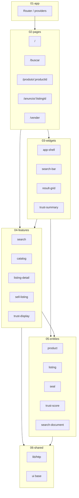
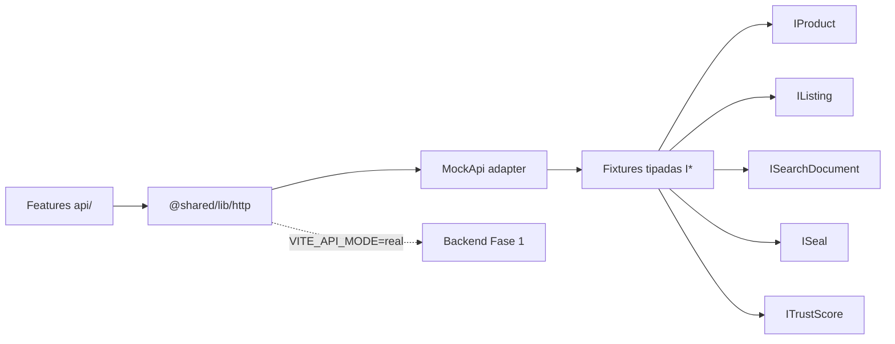

# System design — frontend-web mock (Fase 1)

status: APPROVED  
updatedAt: 2026-08-07  
loop: W00  
gate: REQUIREMENTS_APPROVED → READY_FOR_DEVELOPMENT (após W00)

Documento canônico do **frontend web mockado** da Fase 1. Sem backend real; contratos `I*` de [`docs/backend-entities/`](../backend-entities/). Implementação futura em `src/` sob FSD (`ARCHITECTURE.md`).

---

## 1. Visão

GamerTrust web (Fase 1 mock) prova o canal de **descoberta + confiança + publicar anúncio** com fixtures e `MockApi`, sem HTTP real.

| Princípio | Aplicação no mock |
|-----------|-------------------|
| Confiança > volume | Fixtures com e sem selos; UI nunca inventa verificação |
| Produto ≠ Oferta | Rotas e UI separam modelo (`/produto`) e unidade (`/anuncio`) |
| IA não inventa | Sem sugestões inventadas de preço/atributos no mock |
| Paridade Web ↔ mobile | Mesma hierarquia, selos, TrustScore e ordem do anúncio |

**Fora de escopo (mock P1):** checkout, pagamento, disputa, carrinho multi-item, ads reais (apenas rótulo **Patrocinado** em fixtures).

---

## 2. Personas

| Persona | Papel | Objetivo no mock | Contraste |
|---------|-------|------------------|-----------|
| **Lucas** | Compra cuidadosa | Validar selos, motivos do TrustScore e limites | vs Beatriz (velocidade) |
| **Beatriz** | Comparação | Buscar, filtrar, comparar ofertas do mesmo produto | vs Lucas (profundidade) |
| **Rafael** | Venda ocasional | Publicar anúncio completo com evidências mínimas | vs Carlos (volume) |
| **Carlos** | Vendedor frequente | Fluxo vender rápido, qualidade do anúncio | vs Rafael (orientação) |

Âncora web: Beatriz + Lucas (busca); Rafael + Carlos (vender). Dispositivo: desktop/laptop; restrições: baixa visão e conexão instável quando relevante.

---

## 3. Rotas

| Rota | Página | Persona primária | Dados mock |
|------|--------|------------------|------------|
| `/` | Home — busca dominante | Beatriz / Lucas | Destaques, recomendações **com motivo**, atalhos |
| `/buscar` | Resultados de busca | Beatriz / Lucas | `ISearchDocument[]`, filtros, Patrocinado rotulado |
| `/produto/:productId` | Modelo (catálogo) | Beatriz | `IProduct` + ofertas (`IListing` / cards) |
| `/anuncio/:listingId` | Unidade usada | Lucas | `IListing` + selos + TrustScore + ordem canônica |
| `/vender` | Criação orientada de anúncio | Rafael / Carlos | Draft local → mock submit |

Nav (rótulos/destinos equivalentes à paridade): Início, Buscar, Vender (+ stubs visuais de Categorias/Favoritos/Perfil se necessário, sem lógica P2).

---

## 4. Mapa FSD + ownership Zustand

```text
01-app → 02-pages → 03-widgets → 04-features → 05-entities → 06-shared
```

| Camada | Slices (mock P1) | Responsabilidade |
|--------|------------------|------------------|
| `01-app` | providers, router | Bootstrap, rotas acima |
| `02-pages` | `home`, `search`, `product`, `listing`, `sell` | Orquestração de UI; **sem** axios/regra |
| `03-widgets` | `app-shell`, `search-bar`, `result-grid`, `listing-hero`, `trust-summary` | Blocos compostos |
| `04-features` | `search`, `catalog`, `listing-detail`, `sell-listing`, `trust-display` | Casos de uso + **Zustand** + chamadas API |
| `05-entities` | `product`, `listing`, `seal`, `trust-score`, `search-document`, `category`, `user`/`profile` | Models `I*` + UI crua |
| `06-shared` | `lib/http`, UI base, utils | Client HTTP; **sem** vocabulário de negócio |

### Zustand (ownership em Features)

| Store | Feature | Estado |
|-------|---------|--------|
| `useSearchStore` | `search` | query, filtros, resultados, loading/erro |
| `useCatalogStore` | `catalog` | produto ativo, ofertas do modelo |
| `useListingStore` | `listing-detail` | anúncio ativo, selos, vendedor |
| `useSellStore` | `sell-listing` | draft, steps, validação, submit |
| `useTrustStore` | `trust-display` | cache leve de TrustScore/motivos (opcional se embutido no listing) |

Pages/widgets **consomem** stores/hooks de features; não criam clients HTTP.

---

## 5. MockApi e contratos `I*`

### Contrato HTTP

- Único ponto de I/O: `@shared/lib/http` (`httpClient` Axios).
- Em modo mock, o adapter intercepta ou substitui a base URL e resolve via **MockApi** + fixtures JSON tipadas com as mesmas interfaces de [`docs/backend-entities/`](../backend-entities/).

### Interfaces Fase 1 (consumo UI)

| Interface | Uso no mock |
|-----------|-------------|
| `IProduct` | Página produto; card de modelo |
| `IListing` | Anúncio; oferta no produto; draft vender |
| `ISearchDocument` | Cards de `/buscar` e home |
| `ISeal` | Selos só se `status === GRANTED` (+ não expirado) |
| `ITrustScore` | Score + `components`/motivos visíveis |
| `ICategory` / schema | Filtros e facets |
| `IProfile` (público) | Local aproximado, nível vendedor |
| `IFavorite` | Stub opcional; não bloqueia P1 |

### Superfície MockApi (ilustrativa)

```text
GET  /search?q&filters     → ISearchDocument[]
GET  /products/:id         → IProduct
GET  /products/:id/listings→ IListing[] (PUBLISHED)
GET  /listings/:id         → IListing + seals + seller trust
POST /listings             → cria draft/publicado mock (Rafael/Carlos)
GET  /categories           → árvore ICategory
```

Fixtures: `src/06-shared/...` ou `src/04-features/*/api/fixtures/` — sempre tipadas; cenários **com** e **sem** verificação.

---

## 6. Semântica de confiança (não negociável)

| Regra | UI mock |
|-------|---------|
| **Produto ≠ Oferta** | `/produto` = modelo; `/anuncio` = unidade; copy e hierarquia distintas |
| **Selos** | Só após processo concluído; explicar no clique; data/limites; nunca ícone “verificado” falso |
| **TrustScore** | Níveis + **motivos** (ex.: “12 vendas”, “98% sem problema”); nunca nota isolada absoluta |
| **Patrocinado** | Sempre rotulado; nunca parecer selo de confiança |
| **Cartão** | ≤3 diferenciais; foto real; preço; condição; TrustScore/nível |
| **Ordem do anúncio** | Fotos → preço/CTA → selos → entrega → defeitos → acessórios → specs → testes → vendedor → outras ofertas → semelhantes |

Fonte: [`docs/design-system/paridade-visual.md`](../design-system/paridade-visual.md).

---

## 7. Adoção Pichau / Mercado Livre

Referência: [`docs/backend-entities/_references/marketplace-benchmarks.md`](../backend-entities/_references/marketplace-benchmarks.md).

| Origem | Adotar no mock | Não copiar |
|--------|----------------|------------|
| **Pichau** | Árvore de categorias; card brand+model+specs/MPN; preço + `listPriceCents` opcional; facets marca/chipset | Estoque multi-unidade; PIX/parcelas como engine de preço |
| **Mercado Livre** | Título, condição, mídia da unidade, shipping modes, garantia do vendedor, atributos de categoria, buy-now | Contato imediato; listing_type/ads completos; quantity > 1 |

GamerTrust permanece especializado em **usado + evidência**; quantity = 1.

---

## 8. Plano mock → API real

| Etapa | Ação |
|-------|------|
| 1 | Features chamam só `api/*` que usam `httpClient` |
| 2 | MockApi atrás do mesmo path contract que o backend Fase 1 |
| 3 | Feature flag / env `VITE_API_MODE=mock|real` |
| 4 | Trocar baseURL + desligar interceptor MockApi; fixtures viram seeds de teste |
| 5 | Types `I*` permanecem; zero rewrite de pages/widgets |
| 6 | E2E passa a apontar para staging quando disponível |

**Critério de swap:** nenhum import de fixture fora da camada `api`/shared http adapter.

---

## 9. Índice de loops Ralph (W00–W08)

| Loop | Título | Status |
|------|--------|--------|
| [W00](../ralph/ledgers/loop-w00-system-design.md) | System design (este doc + ledgers) | **DONE** |
| [W01](../ralph/ledgers/loop-w01-app-shell.md) | App shell + tokens de marca | **DONE** |
| [W02](../ralph/ledgers/loop-w02-mock-domain.md) | Mock domain (entities + MockApi) | **DONE** |
| [W03](../ralph/ledgers/loop-w03-home-search.md) | Home + busca dominante | **DONE** |
| [W04](../ralph/ledgers/loop-w04-search-results.md) | Resultados de busca | **DONE** |
| [W05](../ralph/ledgers/loop-w05-product-page.md) | Página do produto | **DONE** |
| [W06](../ralph/ledgers/loop-w06-listing-detail.md) | Detalhe do anúncio + trust | **DONE** |
| [W07](../ralph/ledgers/loop-w07-sell-listing.md) | Wizard Vender | **DONE** |
| [W08](../ralph/ledgers/loop-w08-gates.md) | Gates QA / a11y / visual | **DONE** |

Índice: [`docs/ralph/ledgers/README.md`](../ralph/ledgers/README.md).

---

## 9.1 As-built — brand tokens (logo)

Fonte: [`images/gametrust-logo.png`](../../images/gametrust-logo.png) → `public/brand/gametrust-logo.png`.

| Token CSS | Valor | Uso |
|-----------|-------|-----|
| `--gt-accent` | `#F84000` | CTA, foco, highlights de marca |
| `--gt-accent-hover` | `#D43800` | Hover de CTA |
| `--gt-accent-soft` | `#FFF0EB` | Fundo suave de estado ativo |
| `--gt-text` | `#181818` | Texto / carbon brand |
| `--gt-bg` | `#F5F5F5` | Fundo de página |
| `--gt-surface` | `#FFFFFF` | Superfícies / cards |
| `--gt-seal` / `--gt-seal-bg` | `#0B6E7A` / `#E6F3F5` | Selos **GRANTED** (teal contido; ≠ CTA) |
| `--gt-sponsored` / `--gt-sponsored-bg` | `#5C4A2E` / `#F3EBE0` | Rótulo Patrocinado (≠ selo) |
| `--gt-radius*` | ≤6px | Visual angular alinhado ao wordmark |
| `--gt-font-display` | Exo 2 (italic ok) | Títulos / brand feel |
| `--gt-font` | Rajdhani | Corpo UI |

Implementação: `src/06-shared/styles/` (tokens + Tailwind `@theme`) · fontes em `index.html` (Google Fonts) · logo no `AppShell`.

**Não negociável:** accent de CTA nunca verde; verde/teal de selo só para status concedido; sem purple gradients.

---

## 10. Diagramas

### Camadas FSD (Pages → … → Shared)



### Features → MockApi → Fixtures



---

## 11. DoR para desenvolvimento (pós-W00)

- [x] Visão mock e rotas definidas  
- [x] Personas e contrastes declarados  
- [x] FSD + Zustand ownership  
- [x] Contratos `I*` e plano MockApi  
- [x] Semântica de confiança e benchmarks Pichau/ML  
- [x] Plano de swap mock→real  
- [x] Ledgers W00–W08 criados  

Próximo: gates de release / E2E Playwright conforme roadmap; mock Fase 1 W00–W08 **DONE**.
